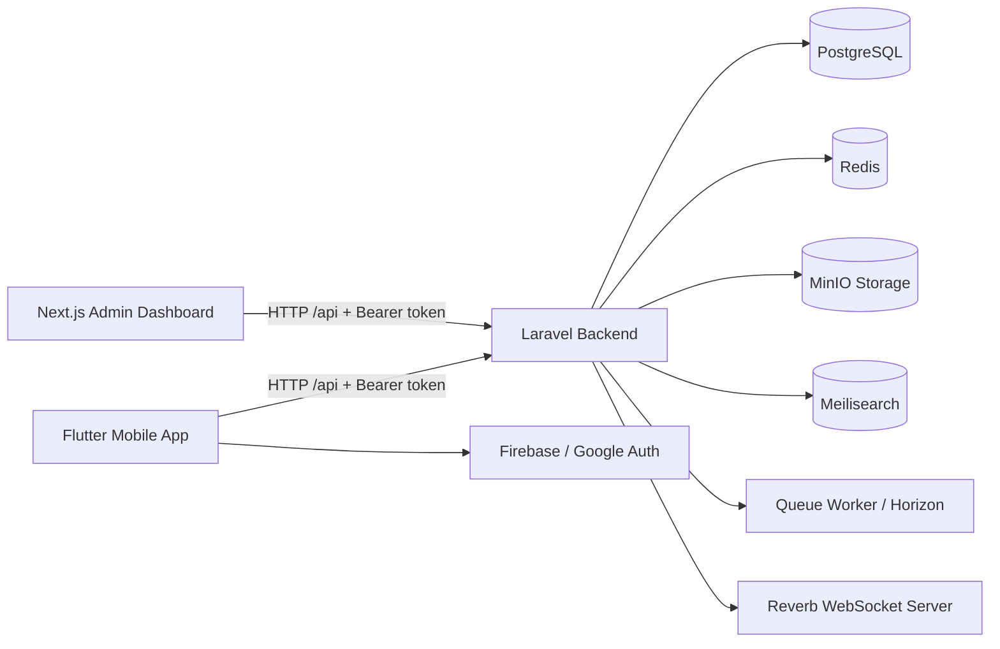
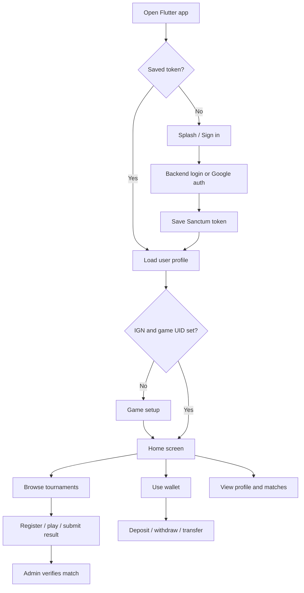

# Battly System Design

This document explains how the Battly project is structured and how the main system works end to end.

## 1. System Overview

Battly is an esports tournament and wallet platform. The workspace contains three main projects:

- `app/` - Flutter mobile app used by players.
- `backend/` - Laravel REST API, database, payments, wallet, tournaments, and admin endpoints.
- `zone/` - Next.js admin dashboard used by staff/admin users.

The Flutter app and the admin dashboard both talk to the Laravel backend through HTTP APIs. The backend stores data in PostgreSQL and uses Redis, queues, MinIO, Meilisearch, and Reverb through Docker services.



## 2. Main Technology Stack

### Mobile App

- Framework: Flutter / Dart.
- Entry file: `app/lib/main.dart`.
- Main screens: `app/lib/screens/`.
- Shared UI widgets: `app/lib/widgets/`.
- Services/API layer: `app/lib/services/`.
- Auth storage: `SharedPreferences`.
- API auth: Laravel Sanctum bearer token.
- Payments: local `esewa_flutter_sdk`.

### Backend API

- Framework: Laravel 13 / PHP 8.3.
- Entry routes: `backend/routes/api.php` and `backend/routes/web.php`.
- Controllers: `backend/app/Http/Controllers/Api/`.
- Models: `backend/app/Models/`.
- Database migrations: `backend/database/migrations/`.
- Auth: Laravel Sanctum personal access tokens.
- Runtime: Docker Compose with Nginx, PHP-FPM, PostgreSQL, Redis, MinIO, Meilisearch, Reverb, worker, and Horizon.

### Admin Dashboard

- Framework: Next.js 16 / React 19 / TypeScript.
- Entry layout: `zone/src/app/layout.tsx`.
- Auth page: `zone/src/app/auth/page.tsx`.
- Dashboard pages: `zone/src/app/(dashboard)/`.
- API wrapper: `zone/src/lib/api.ts`.
- Local state: Zustand and browser `localStorage`.

## 3. How The System Starts

### Mobile app startup

1. Flutter runs `app/lib/main.dart`.
2. Firebase is initialized.
3. `AuthGate` checks if a saved auth token exists through `AuthService`.
4. If the user is not logged in, the app shows `SplashScreen`, then `SigninScreen`.
5. If the user is logged in but missing `ign` or `game_uid`, the app opens `GameSetupScreen`.
6. If the user profile is complete, the app opens `HomeScreen`.

The main mobile shell is `HomeScreen`. It uses a bottom navigation bar with four tabs:

- Home
- Tournaments
- Wallet
- Profile

### Backend startup

The backend is designed to run from `backend/docker-compose.yml`.

Important exposed services:

- Laravel API through Nginx on port `8888`.
- PostgreSQL on port `5432`.
- Redis on port `6379`.
- MinIO on ports `9000` and `9001`.
- Meilisearch on port `7700`.
- Reverb WebSocket server on port `8080`.

### Admin dashboard startup

The admin dashboard runs from `zone/` with Next.js. Its API wrapper uses:

```ts
const BASE_URL = 'http://localhost:8888/api';
```

Admin users log in through the same Laravel `/api/login` endpoint and store the token in browser `localStorage`.

## 4. Authentication Flow

The backend uses Laravel Sanctum tokens. Both the mobile app and admin dashboard send the token as:

```http
Authorization: Bearer <token>
```

### Mobile auth flow

1. User signs in from `app/lib/auth/signin_screen.dart`.
2. `AuthService` sends auth requests to the backend.
3. Backend returns a user object and Sanctum token.
4. Mobile app saves the token and user data in `SharedPreferences`.
5. `AuthGate` routes the user to game setup or home.

Important files:

- `app/lib/services/auth_service.dart`
- `app/lib/auth/signin_screen.dart`
- `app/lib/auth/game_setup_screen.dart`
- `backend/app/Http/Controllers/Api/AuthController.php`
- `backend/routes/api.php`

Important auth endpoints:

- `POST /api/register`
- `POST /api/login`
- `POST /api/auth/google`
- `GET /api/user`
- `PUT /api/user`
- `POST /api/logout`
- `DELETE /api/user`

## 5. Mobile App Structure

The mobile app is screen-driven. Screens call service classes directly and update local widget state with `setState`.

Important folders:

- `app/lib/auth/` - sign in and game profile setup.
- `app/lib/screens/wallet/` - wallet, add money, withdraw, transfer, history.
- `app/lib/screens/tournament/` - tournament details, creation, management, match flow.
- `app/lib/screens/profile/` - profile, account settings, matches, support, legal screens.
- `app/lib/widgets/` - reusable cards, app bars, navigation, skeleton loading UI, sheets.
- `app/lib/services/` - backend communication layer.

The app does not use Provider, Riverpod, Bloc, or a routing package. It uses `Navigator.push` and `MaterialPageRoute`.

## 6. Backend API Structure

Main backend route file: `backend/routes/api.php`.

Public routes:

- `POST /api/register`
- `POST /api/login`
- `POST /api/auth/google`
- `GET /api/tournaments`
- `GET /api/tournaments/featured`
- `GET /api/tournaments/{id}`
- `GET /api/banners`

Authenticated routes:

- User profile routes under `/api/user`.
- Tournament register/create/manage routes.
- Match history routes.
- Wallet routes.
- Admin dashboard routes.
- Teams, scrims, notifications, banners, and match verification routes.

Main backend controllers:

- `AuthController` - login, register, Google auth, profile.
- `TournamentController` - tournament list, details, create, register, manage.
- `WalletController` - wallet balance, deposit, withdraw, transfer, transactions.
- `MatchController` - player match history and admin match verification.
- `AdminController` - dashboard stats, staff, teams, scrims, notifications, wallet ledger.
- `BannerController` - home/admin banner data.

## 7. Main Data Model

The backend database is managed by migrations in `backend/database/migrations/`.

Core data tables:

- `users` - account, role, IGN, game UID, avatar, wallet balance.
- `personal_access_tokens` - Sanctum API tokens.
- `tournaments` - tournament metadata, prize pool, entry fee, room/status fields.
- `game_matches` - tournament participation and match results.
- `transactions` - wallet ledger, deposits, withdrawals, transfers, payment references.
- `teams` - admin/team data.
- `scrims` - scrim schedule and status.
- `notifications` - admin/player notifications.
- `banners` - home carousel/admin banner content.

The mobile app has Dart models in `app/lib/models/mock_data.dart` for tournaments and matches. Wallet transaction models are currently defined inside the wallet/history screen area instead of a dedicated model file.

## 8. Tournament Flow

Tournament discovery starts from the mobile home screen and tournaments tab.

1. Mobile app calls `ApiService`.
2. `ApiService` requests tournament/banner data from Laravel.
3. Home screen displays banners, featured tournaments, upcoming tournaments, and recent matches.
4. User taps a tournament card.
5. `TournamentScreen` loads tournament details.
6. User registers through `POST /api/tournaments/{id}/register`.
7. Backend creates/updates a `game_matches` row and may handle entry fee logic through wallet balance.

Owner/admin functions include:

- Create tournament.
- Update room code.
- Update tournament status.
- Remove participants.
- Verify/reject match results from the admin dashboard.

Important files:

- `app/lib/services/api_service.dart`
- `app/lib/screens/tournaments_tab_view.dart`
- `app/lib/screens/tournament/tournament_screen.dart`
- `backend/app/Http/Controllers/Api/TournamentController.php`
- `backend/app/Http/Controllers/Api/MatchController.php`

## 9. Wallet Flow

Wallet is used by players for balance, deposits, withdrawals, transfers, and transaction history.

1. `WalletScreen` loads the balance with `GET /api/wallet/balance`.
2. It loads recent transactions with `GET /api/wallet/transactions`.
3. Add money opens `AddMoneyScreen`.
4. Deposit starts with `POST /api/wallet/deposit/initiate`.
5. Payment is handled with the local eSewa SDK or backend eSewa checkout route.
6. Deposit confirmation updates the transaction and wallet balance.
7. Withdraw and transfer screens call backend wallet endpoints.
8. Transaction history is paginated from the backend.

Important endpoints:

- `GET /api/wallet/balance`
- `GET /api/wallet/transactions`
- `GET /api/wallet/transactions/{id}`
- `POST /api/wallet/deposit/initiate`
- `POST /api/wallet/deposit/confirm`
- `POST /api/wallet/withdraw`
- `GET /api/wallet/search-recipient`
- `POST /api/wallet/transfer`

Important files:

- `app/lib/screens/wallet/wallet_screen.dart`
- `app/lib/screens/wallet/add_money_screen.dart`
- `app/lib/screens/wallet/withdraw_screen.dart`
- `app/lib/screens/wallet/transfer_screen.dart`
- `app/lib/screens/wallet/transaction_history_screen.dart`
- `app/lib/services/wallet_service.dart`
- `backend/app/Http/Controllers/Api/WalletController.php`

## 10. Admin Dashboard Flow

The admin dashboard is in `zone/`.

1. Admin opens the dashboard.
2. If no token exists, the dashboard redirects to the auth page.
3. Admin logs in through `POST /api/login`.
4. The dashboard stores `battly_token` and `battly_user` in `localStorage`.
5. Dashboard pages call Laravel using `zone/src/lib/api.ts`.

Admin features include:

- Dashboard stats.
- Tournament management.
- Match verification/rejection.
- Team and scrim management.
- User/staff management.
- Wallet transaction ledger.
- Notifications.
- Banner management.

Important admin endpoints:

- `GET /api/admin/stats`
- `GET /api/admin/users`
- `POST /api/admin/users/invite`
- `DELETE /api/admin/users/{user}/revoke`
- `GET /api/admin/wallet/transactions`
- `POST /api/admin/wallet/withdraw`
- `GET /api/admin/matches`
- `POST /api/admin/matches/{match}/verify`
- `POST /api/admin/matches/{match}/reject`
- `POST /api/admin/tournaments`
- `PUT /api/admin/tournaments/{id}`

## 11. Caching And State

### Mobile app caching

The Flutter app stores auth token and cached user data in `SharedPreferences`.

`ApiService` also uses cache-first behavior for some home data:

- Banners.
- Featured tournaments.
- Upcoming tournaments.
- Recent matches.

The normal flow is:

1. Return cached data quickly if available.
2. Refresh from the backend.
3. Save fresh data for later reads.

### Admin dashboard state

The admin dashboard stores auth state in browser `localStorage`. It also uses React Query and Zustand for client-side dashboard state.

### Backend cache/queue

The backend has Redis, queues, and Horizon configured. Some data can be cached by Laravel, and background work can run through queue workers.

## 12. Payment Flow

Battly wallet deposit currently centers on eSewa.

Flow:

1. Mobile app asks backend to initiate a deposit.
2. Backend creates a pending `transactions` record.
3. User completes payment through eSewa.
4. Backend receives or confirms the payment.
5. Backend marks the transaction completed.
6. Backend updates `users.wallet_balance`.
7. Mobile app refreshes wallet balance and transactions.

Web routes for eSewa callbacks live in `backend/routes/web.php`.

## 13. End-To-End User Journey



## 14. Important Design Notes

- The mobile app is simple and screen-based. It does not have a global state management layer.
- The backend is the source of truth for users, tournaments, matches, wallet balance, and transactions.
- The Flutter app and admin dashboard both use the same Laravel API and Sanctum token style.
- Admin routes are grouped under `auth:sanctum`, but the route file does not show a dedicated role middleware on those admin endpoints. That means role checks should be reviewed carefully before production.
- API base URLs are hard-coded in places:
  - Flutter uses `app/lib/services/api_config.dart`.
  - Admin dashboard uses `zone/src/lib/api.ts`.
- Match result submission in the mobile app appears partly UI-driven; backend match verification exists for admin.
- Reverb and Meilisearch are configured in Docker, but client-side real-time/search usage is limited or not fully wired yet.

## 15. Quick Run Reference

Backend:

```bash
cd backend
docker compose up
```

Admin dashboard:

```bash
cd zone
npm run dev
```

Flutter app:

```bash
cd app
flutter run
```

Default API URL used by clients is port `8888`.

## 16. Short Summary

Battly works as a three-part system. The Flutter app is the player-facing client, the Laravel backend owns all data and business logic, and the Next.js dashboard gives admins control over tournaments, users, matches, wallet transactions, notifications, and banners. Users authenticate through the backend, receive a Sanctum token, and then use that token for every protected API request. Tournament and wallet actions start in the mobile app, are processed by Laravel, stored in PostgreSQL, and can be reviewed or managed from the admin dashboard.
