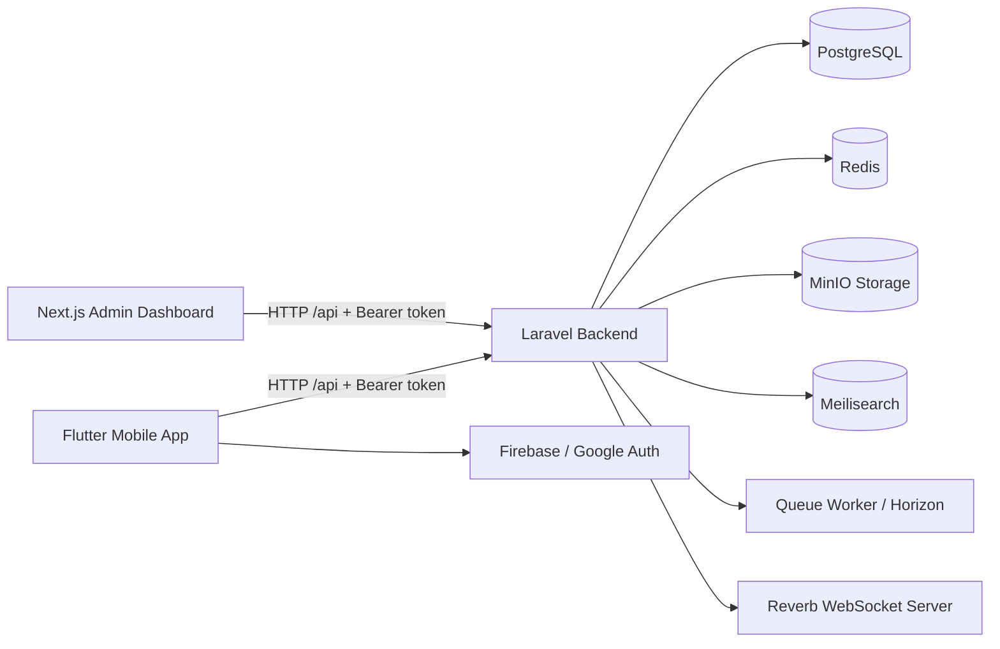
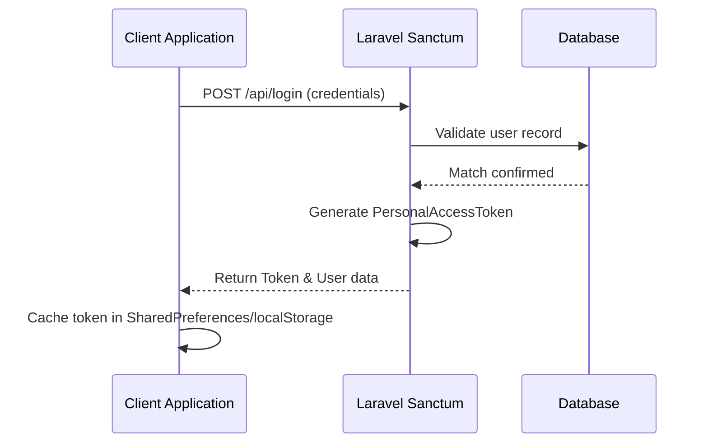
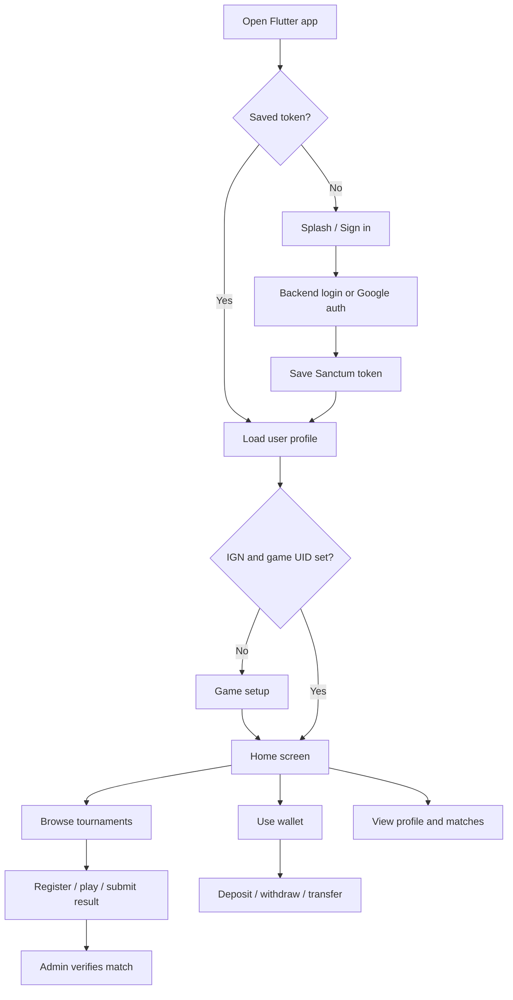

# Battly Project Central Knowledge Base (brain.md)

This document represents the full system design, architecture specifications, API references, directory layout patterns, and implementation notes for the Battly tournament and wallet platform.

---

## 1. System Overview

Battly is an esports tournament and wallet platform. The workspace contains three main projects:
- **`app/`**: Flutter mobile application used by players.
- **`backend/`**: Laravel REST API, database models, payment triggers, tournament orchestrations, and admin APIs.
- **`zone/`**: Next.js admin dashboard used by staff/admin users.

Both clients communicate with the backend via HTTP API endpoints using Laravel Sanctum bearer tokens.



---

## 2. Technology Stack Spec

### A. Mobile Client (`app/`)
- **Framework**: Flutter / Dart
- **State Management**: Local widget `setState` + cache-first API service model
- **Authentication**: Laravel Sanctum bearer token stored via `SharedPreferences`
- **Routing**: Native `Navigator.push` with `MaterialPageRoute`
- **Payments**: Local `esewa_flutter_sdk` integration
- **Main Paths**:
  - Entry point: `app/lib/main.dart`
  - Screens: `app/lib/screens/`
  - Reusable UI widgets: `app/lib/widgets/`
  - Service/API wrappers: `app/lib/services/`

### B. Backend REST API (`backend/`)
- **Framework**: Laravel 13 / PHP 8.3
- **Primary Database**: PostgreSQL
- **Key Services**: Redis (caching), Queue Worker/Horizon (jobs), MinIO (object storage), Meilisearch (full-text search), Laravel Reverb (WebSockets)
- **Local Dev Sandbox**: Managed via Docker Compose
- **Main Paths**:
  - Entry routes: `backend/routes/api.php` and `backend/routes/web.php`
  - Controllers: `backend/app/Http/Controllers/Api/`
  - Models: `backend/app/Models/`
  - Database migrations: `backend/database/migrations/`

### C. Admin Dashboard Front-End (`zone/`)
- **Framework**: Next.js 16 / React 19 / TypeScript
- **Styling**: Vanilla CSS + TailwindCSS (v4)
- **UI Components**: Base UI triggers (using `render={<Element />}` composition)
- **State Management**: Zustand (local) + React Query (caching & API state)
- **Main Paths**:
  - Entry layout: `zone/src/app/layout.tsx`
  - Dashboard routes: `zone/src/app/(dashboard)/`
  - API helper: `zone/src/lib/api.ts`

---

## 3. How The System Starts

### A. Mobile Client Startup
1. Flutter runs `app/lib/main.dart`.
2. Firebase is initialized.
3. `AuthGate` checks if a saved auth token exists through `AuthService`.
4. If missing, it goes: `SplashScreen` -> `SigninScreen`.
5. If token exists but profile parameters (`ign` or `game_uid`) are missing, it redirects to `GameSetupScreen`.
6. If profile is complete, it boots to `HomeScreen` (which exposes four tabs: Home, Tournaments, Wallet, Profile).

### B. Backend Services Startup
Exposed services via Docker:
- Laravel HTTP server on port `8888`
- PostgreSQL on port `5432`
- Redis cache on port `6379`
- MinIO Object storage on ports `9000` (API) & `9001` (Console)
- Meilisearch on port `7700`
- Reverb WebSockets on port `8080`

Run parameters:
```powershell
cd backend
docker compose up -d --build
docker compose exec app php artisan migrate --seed
docker compose exec app php artisan storage:link
```
*Seeded admin credentials: `ganesh@battly.zone` / `password`*

### C. Admin Dashboard Startup
Admin users authenticate with the Laravel `/api/login` endpoint. Tokens are persisted in browser `localStorage`.
Exposed local Next.js client runs on port `3000`:
```powershell
cd zone
copy .env.example .env.local
npm install
npm run dev
```

---

## 4. Authentication Flow

Both clients use standard Laravel Sanctum tokens sent in request headers:
```http
Authorization: Bearer <token>
```



---

## 5. Wallet Ledger & Payment Workflow

Wallet deposits are processed through eSewa:
1. Mobile app requests backend to initiate a deposit: `POST /api/wallet/deposit/initiate`.
2. Backend creates a pending `transactions` row.
3. User completes checkout in the app.
4. eSewa callback calls `POST /api/wallet/deposit/confirm` with merchant credentials.
5. Backend verifies payload, marks transaction completed, and increments `users.wallet_balance`.
6. Client refreshes balance: `GET /api/wallet/balance`.

---

## 6. End-to-End User Journey



---

## 7. Recent Core Implementations

### Flutter Upcoming Tournament Card Redesign
- **Layout**: Switched from multi-column rows (which caused overflow warnings on narrow screens) to a robust 2-column layout.
- **Wrap chips**: Roster and mode tags wrap dynamically inside `Wrap` widget to prevent RenderFlex overflow.
- **Design Structure**: Extracted card segments into reusable private widgets:
  - `_LogoBadge` (rectangular logo border with radius `6.0` and fallback default loader)
  - `_FormatChip` (matches formats)
  - `_SlotsProgressBar` (visualized progress indicator)
  - `_RewardPill` (highlights NPR values)
- **Verification**: Run `flutter analyze` inside `app/` directory.

### Admin Dashboard — Tournament Actions Dropdown
- **Location**: `zone/src/components/admin/TournamentActionsDropdown.tsx`
- **Implementation**: Renders Base UI's `<DropdownMenu>` containing:
  - *View Hub*, *Edit Settings*, *Tournament Report*, *Disputes & Reports*, *Cancel Tournament*.
- **Generics Refactoring**: Made props generic:
  `TournamentActionsDropdown<T extends BaseTournament>({ tournament, ... })`
  to handle callback parameter covariance check compatibility inside the main catalog table.

### Admin Dashboard — Standalone Tournament Hub
- **Path**: `zone/src/app/(dashboard)/tournaments/[id]/page.tsx`
- **Sub-Console Tabs**:
  1. **Overview**: Live display of configurations (game, schedule, slots progress).
  2. **Participants**: Complete roster with a **Kick Player** action which invokes `DELETE /tournaments/[id]/participants/[userId]` and updates the registry count.
  3. **Disputes**: Lists matches disputes and player anti-cheat report logs (fed by `useAdminDisputes()`), offering direct Resolve and Dismiss commands.
  4. **Financial Logs**: Live P&L balance calculator (gross entry fee revenues minus committed prizes).

---

## 8. Development Verification Guidelines

To ensure changes do not introduce regressions, always run:

### Frontend Front-End Type Check & Production Compile
```powershell
cd zone
npx tsc --noEmit
npm run build
```

### Mobile App Static Analysis
```powershell
cd app
flutter analyze
```
