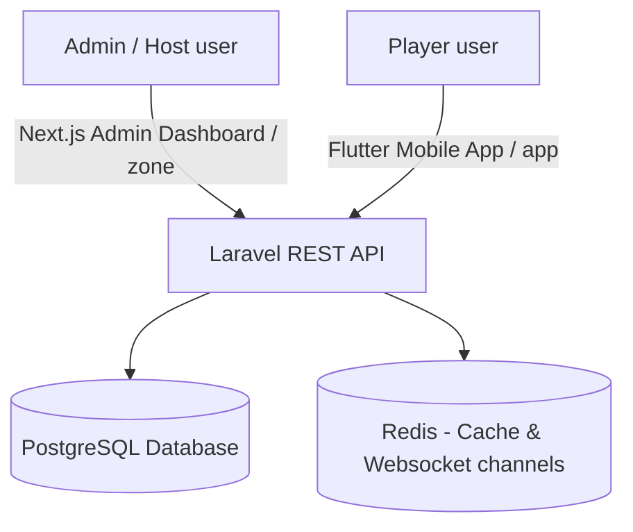
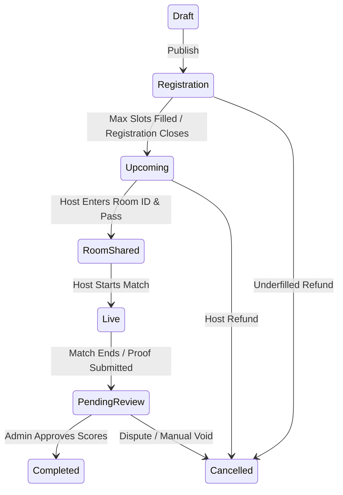
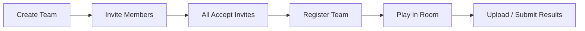
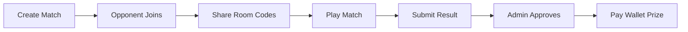
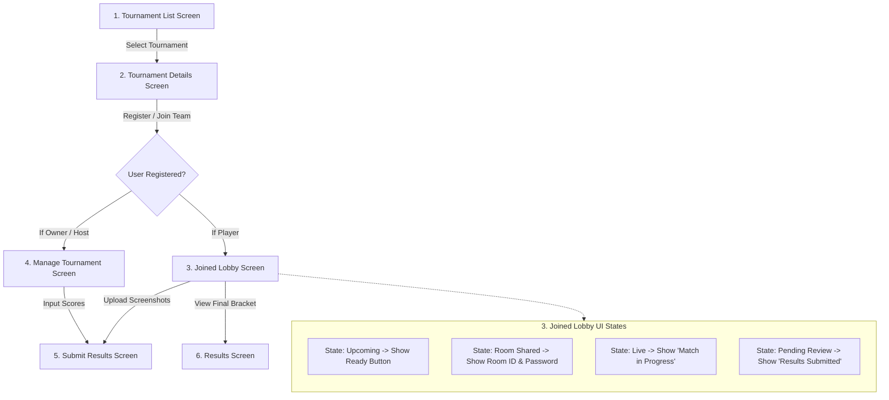

# Battly Tournament System Design (`tournament.md`)

This document outlines the simplified, production-grade system architecture, lifecycle, and client-server workflows for the esports tournament module of the **Battly** platform.

---

## 1. System Architecture Overview

The system runs on a service-oriented model where both mobile players and web-based administrators communicate with a centralized backend API.

- **Backend REST API (Laravel 13 + PostgreSQL)**: Holds the state of all tournaments, registrations, brackets, and wallets.
- **Admin Dashboard Front-End (`zone/`)**: Used by administrators/staff to approve results, override configurations, resolve disputes, and initiate payouts.
- **Mobile Client (`app/`)**: The main interface for players. Built as a streamlined workflow consisting of **6 core screens**, where sub-features and real-time states are handled using tabs or dynamic status-based widgets rather than discrete files.

---

## 2. Simplified Tournament States

A tournament progresses through the following database status states (`tournaments.status`):

- **`Draft`**: Created by host but not yet visible to the public.
- **`Registration`**: Open for players/teams to join.
- **`Upcoming`**: Registration closed. Waiting room check-ins begin.
- **`Room Shared`**: Custom lobby Room ID and Password are set and locked.
- **`Live`**: Players are actively playing in-game.
- **`Pending Review`**: Matches completed. Proofs/scores uploaded, waiting for verification.
- **`Completed`**: Admin approves results, prizes distributed to wallets, ledger closed.
- **`Cancelled`**: Refund triggers executed, tournament terminated.

---

## 3. Core Workflows by Mode

### A. Team / Squad Mode (2v2 / 4v4)

1. Captain creates a team lobby.
2. Invites teammates in-app.
3. Teammates accept the invitation.
4. Captain registers the team using the wallet balance.
5. Team plays in the shared custom room.
6. Captain uploads results.

### B. Solo Match / Lone Wolf Mode (1v1)

- No complex roster invite system is needed. The opponent registers directly into the bracket slot, and both are immediately matched.

---

## 4. Screen Navigation Flowchart

This diagram illustrates how the **6 core screens** interact with the user role and tournament states:

---

## 5. The 6 Core Screens Specification

Rather than spawning individual screens for every micro-interaction, the tournament system uses only 6 main screens, wrapping secondary actions inside dynamic conditional views.

### 1. Tournament List Screen
- **Description**: The browsing catalog of upcoming, live, and completed tournaments.
- **Tabs / Sub-views**:
  - `All`, `Upcoming`, `Live`, `Completed`.
  - Filter sheet (Game Mode, Solo/Duo/Squad, Free/Paid entry).
  - Search sheet.

### 2. Tournament Details Screen
- **Description**: The public overview page where players read terms and register.
- **Tabs / Sub-views**:
  - `OVERVIEW`: Timeline, countdown to registration close, and registered team previews.
  - `PRIZE POOL`: Visual payout allocations based on the slots distribution.
  - `RULES`: Weapon bans, character limitations, and referee policies.
  - `PLAYERS / TEAMS`: The participant roster.
- **Dynamic Buttons**:
  - Unregistered -> Shows "Register Now" (initiates wallet checks & team requirements).
  - Registered -> Redirects to **Joined Lobby**.
  - Host/Owner -> Redirects to **Manage Tournament**.

### 3. Joined Lobby Screen (One Unified Player Lobby)
- **Description**: Replacing multiple individual screens (Match Ready, Match Codes, etc.), this single view dynamically pivots its layout and options in real-time according to the tournament status.
- **Dynamic Layout States**:
  1. **`Status = Registration`**:
     - *UI*: Show "Waiting for Registrations" banner, registration stats progress bar.
     - *Actions*: "Leave Tournament" button (triggers entry fee refund to wallet).
  2. **`Status = Upcoming`**:
     - *UI*: Show a countdown to start. Full checklist of players in the lobby.
     - *Actions*: "Mark Ready" / "Cancel Ready" toggle button.
  3. **`Status = Room Shared`**:
     - *UI*: "Room Credentials Secured" notification card.
     - *Actions*: Display **Room ID** and **Password** with one-tap copy buttons.
  4. **`Status = Live`**:
     - *UI*: Show a "Match in Progress" visual animation and notification banner.
     - *Actions*: Disables all check-in actions.
  5. **`Status = Pending Review`**:
     - *UI*: Show "Match Completed - Awaiting Review" status.
     - *Actions*: Button to open **Submit Results Screen** or view submissions.
  6. **`Status = Completed`**:
     - *UI*: Show completion status card.
     - *Actions*: "View Final Bracket & Winnings" button (redirects to **Results Screen**).

### 4. Manage Tournament Screen (Host Console)
- **Description**: The single control center for the tournament owner or referee.
- **Tabs / Sub-views**:
  - `PLAYERS`: Manage checks-ins, kick underfilled rosters, and view readiness checklist.
  - `CHAT`: Write real-time announcements or warnings to players.
  - `ROOM`: Enter custom Room ID and Password inputs to update the status to `Room Shared`.
  - `STATUS`: Trigger lifecycle transitions (Upcoming -> Live -> Pending Review -> Cancelled).
  - `RESULTS`: Quick access to record score positions.

### 5. Submit Results Screen
- **Description**: Where players or hosts report final match outputs.
- **Features**:
  - Input fields for Rank, Kills, and Total Points.
  - Dual screenshot upload slots to capture mobile scoreboard proof.
  - Confirm checkbox to ensure statements are correct.

### 6. Results Screen
- **Description**: Displays the historical standings, logs, and winnings.
- **Features**:
  - Final round standings, kills, and points charts.
  - Visual checkmark badges indicating "Verified" payouts.
  - Payout wallet transaction ledger links.

---

## 6. Backend Database Models & Triggers

### `Tournament` Model
Represents configurations and current status:
- `title`, `game`, `status` (`Draft`, `Registration`, `Upcoming`, `RoomShared`, `Live`, `PendingReview`, `Completed`, `Cancelled`).
- `max_players`, `current_players`.
- `prize_pool`, `entry_fee`.
- `custom_settings` (JSON holding characters, maps, weapon configurations, room credentials).

### `Participant` Model
Links users to tournaments:
- `user_id`, `tournament_id`.
- `status` (`registered`, `checked_in`).
- `is_ready` (boolean flag for check-in).
- `entry_fee_paid` (decimal audited entry price).

### Wallet Ledger Triggers
Handles registration and cancellation triggers:
- **On Register**: Initiates checks on `users.wallet_balance`. Deducts the fee, adds a transaction ledger line, and locks the slot.
- **On Cancel**: SQL hook/Eloquent callback iterates through all locked `participants` records, restores balances, creates reversal transactions, and broadcasts a Cancellation push notification.
